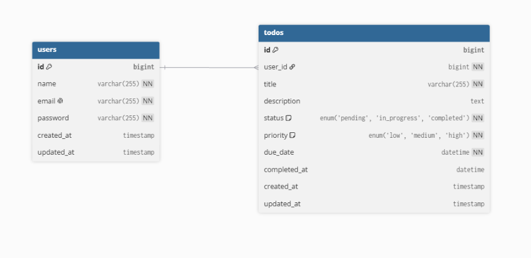

# Todo 

## Deskripsi

Todo adalah website yang dibuat menggunakan framework Laravel dan database MySQL untuk mencatat serta mengelola tugas pengguna.

Setiap pengguna dapat membuat akun, login, menambahkan Todo, mengubah Todo, menghapus Todo, serta mengatur status, prioritas dan tanggal jatuh tempo.

Setiap Todo hanya dapat dilihat dan dikelola oleh pengguna yang membuat Todo tersebut.

---

## Fitur

- Register akun
- Login dan Logout
- Dashboard ringkasan Todo
- Menambahkan Todo
- Melihat daftar Todo
- Mengedit Todo
- Menghapus Todo
- Status Todo:
  - Pending
  - Dalam Proses
  - Selesai
- Prioritas Todo:
  - Rendah
  - Sedang
  - Tinggi
- Tanggal jatuh tempo atau deadline
- Informasi sisa hari menuju deadline
- Informasi Todo yang sudah melewati deadline
- Mencatat waktu ketika Todo selesai
- Tampilan responsive untuk desktop dan mobile

---

## Dokumentasi Penggunaan

### 1. Register

Pengguna yang belum memiliki akun dapat membuka halaman **Register**.

Isi data berikut:

- Nama
- Email
- Password
- Konfirmasi Password

Setelah registrasi berhasil pengguna akan diarahkan ke halaman Login.

### 2. Login

Masukkan email dan password yang telah didaftarkan.

Jika email dan password benar pengguna akan diarahkan ke halaman Dashboard.

### 3. Dashboard

Dashboard menampilkan ringkasan Todo pengguna yaitu:

- Total Todo
- Pending
- Dalam Proses
- Selesai
- Deadline terdekat

Pada Dashboard juga tersedia tombol untuk menambahkan Todo baru dan melihat semua Todo.

### 4. Menambahkan Todo

Pilih tombol **Tambah Todo Baru** atau **+ Tambah Todo**.

Isi data Todo:

- Judul
- Deskripsi
- Status
- Prioritas
- Tanggal jatuh tempo

Setelah menekan tombol **Tambah Todo** Todo akan disimpan dan ditampilkan pada halaman Todos.

### 5. Mengedit Todo

Pada halaman Todos pilih tombol **Edit** pada Todo yang ingin diperbarui.

Pengguna dapat mengubah:

- Judul
- Deskripsi
- Status
- Prioritas
- Tanggal jatuh tempo

Kemudian pilih tombol **Update Todo** untuk menyimpan perubahan.

Jika status Todo diubah menjadi **Selesai** website akan mencatat waktu penyelesaian Todo.

### 6. Menghapus Todo

Pilih tombol **Hapus** pada Todo yang ingin dihapus.

website akan menampilkan konfirmasi sebelum Todo dihapus.

### 7. Logout

Pilih tombol **Logout** untuk keluar dari website.

---

## ERD

Berikut adalah Entity Relationship Diagram (ERD) dari website Todo List:

ERD memiliki dua entitas utama yaitu:

- `users`
- `todos`

Relasi antara tabel `users` dan `todos` adalah **One to Many**.

Satu user dapat memiliki banyak Todo sedangkan satu Todo hanya dimiliki oleh satu user.